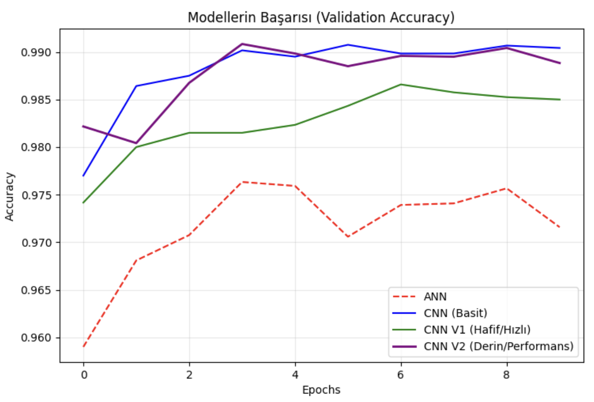
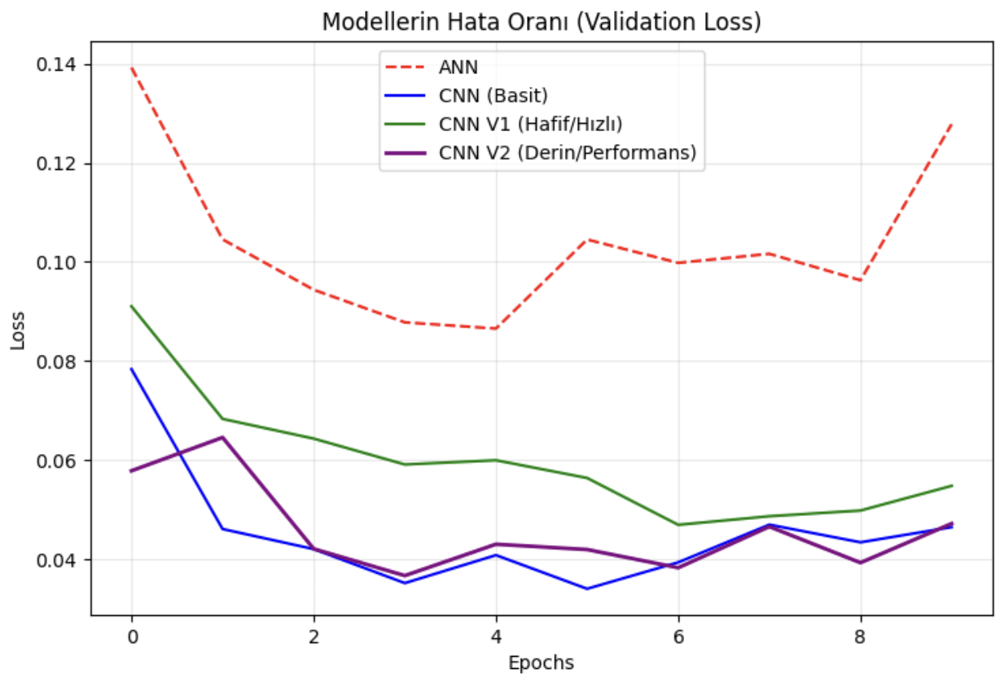
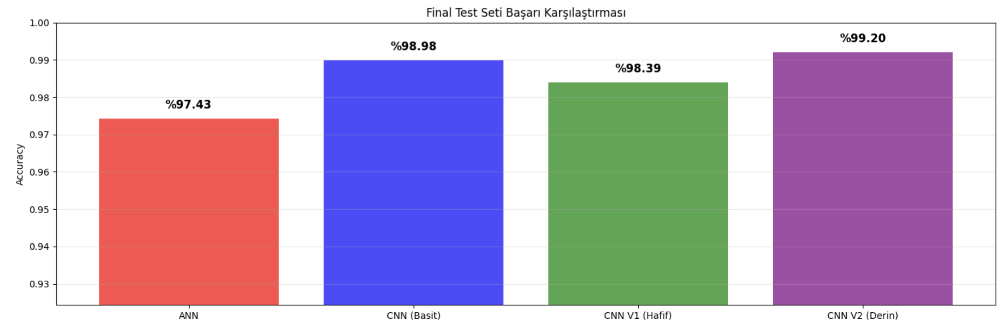

# 🧠 MNIST Classification: Performance vs. Cost Analysis


## 📌 Proje Özeti
Bu proje, Derin Öğrenme (Deep Learning) mimarilerinin **performans (doğruluk)** ve **hesaplama maliyeti (parametre sayısı/süre)** arasındaki ilişkiyi incelemek amacıyla geliştirilmiştir. 

MNIST veri seti üzerinde; standart bir **Yapay Sinir Ağı (ANN)** ve **Evrişimli Sinir Ağlarının (CNN)** farklı varyasyonları (Hafif, Standart, Derin) karşılaştırmalı olarak test edilmiştir.

## 🏗️ Kullanılan Mimariler
Proje kapsamında 4 farklı model mimarisi kurgulanmış ve test edilmiştir:

1.  **ANN (Baseline):** Görüntü işleme yeteneği sınırlı, sadece piksel yoğunluklarına bakan referans model.
2.  **Simple CNN:** Standart evrişim katmanlarına sahip temel model.
3.  **CNN V1 (Low-Cost / Lightweight):** Daha az filtre (16-32) kullanılarak optimize edilmiş, mobil/gömülü sistemlere uygun hafif model.
4.  **CNN V2 (High-Performance / Deep):** Çift evrişim blokları ve artırılmış derinlik ile maksimize edilmiş performans modeli.

## 📊 Deneysel Sonuçlar

Modellerin test seti üzerindeki başarı oranları ve parametre sayıları aşağıdaki gibidir:

| Model | Mimari Tipi | Parametre Sayısı | Test Accuracy | Maliyet/Performans Yorumu |
| :--- | :--- | :--- | :--- | :--- |
| **ANN** | Dense Layers | ~109,386 | %97.43 | Düşük maliyet, en düşük mekansal başarım. |
| **Simple CNN** | Conv2D (32-64) | ~225,034 | %98.98 | Dengeli bir başlangıç noktası. |
| **CNN V1** | **Lightweight** | **~12,810** | **%98.39** | **En Verimli.** 18 kat daha az parametre ile %98+ başarım. |
| **CNN V2** | **Deep** | ~197,482 | **%99.20** | **En Yüksek Performans.** İşlem yükü fazla ancak hata oranı minimal. |

> **Not:** CNN V2 modelinde parametre sayısı Simple CNN'e göre daha düşük görünse de (Pooling katmanlarının etkisiyle Dense katmana giren verinin azalması), **katman sayısının artması** nedeniyle işlemci üzerindeki yük (computational cost) ve eğitim süresi en yüksek olan modeldir.

## 📈 Görselleştirme

Modellerin eğitim süreçleri ve final karşılaştırmaları:

### 1. Eğitim Süreci (Validation Accuracy & Loss)
Modellerin epoch bazında öğrenme performansları. Mor çizginin (CNN V2) yüksek başarısına ve yeşil çizginin (CNN V1) hızlı adaptasyonuna dikkat edin.

**Doğruluk (Accuracy) Grafiği:**


**Hata (Loss) Grafiği:**


### 2. Final Doğruluk Karşılaştırması
Test seti üzerindeki nihai sonuçlar. CNN V2 modelinin en yüksek başarıma sahip olduğu, hafif modelin (V1) ise çok yakın bir performans sergilediği görülmektedir.


    ```

## 📝 Sonuç ve Çıkarımlar
* **Verimlilik:** **CNN V1**, sadece 12k parametre ile referans modellere kafa tutarak, kaynak kısıtı olan sistemler (IoT, Mobil) için ideal olduğunu kanıtladı.
* **Performans:** **CNN V2**, daha derin bir mimarinin (çift Conv blokları) basit şekilleri daha karmaşık özelliklere dönüştürme yeteneği sayesinde %99.20 gibi yüksek bir başarıma ulaştı.
* **ANN vs CNN:** ANN'in mekansal veriyi (piksel komşuluklarını) kaybetmesi nedeniyle görüntü işlemede CNN'lerin gerisinde kaldığı bir kez daha doğrulandı.

